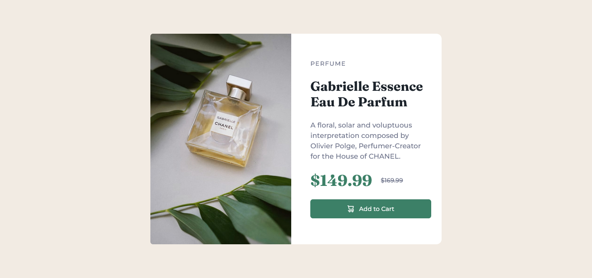

# Frontend Mentor - Product preview card component solution

This is a solution to the [Product preview card component challenge on Frontend Mentor](https://www.frontendmentor.io/challenges/product-preview-card-component-GO7UmttRfa). Frontend Mentor challenges help you improve your coding skills by building realistic projects.

## Table of contents

- [Overview](#overview)
  - [The challenge](#the-challenge)
  - [Screenshot](#screenshot)
  - [Links](#links)
- [My process](#my-process)
  - [Built with](#built-with)
  - [What I learned](#what-i-learned)
  - [Continued development](#continued-development)
  - [Useful resources](#useful-resources)
- [Author](#author)
- [Acknowledgments](#acknowledgments)

**Note: Delete this note and update the table of contents based on what sections you keep.**

## Overview

### The challenge

Users should be able to:

- View the optimal layout depending on their device's screen size
- See hover and focus states for interactive elements

### Screenshot



### Links

- Solution URL: [Github](https://your-solution-url.com)

## My process

### Built with

- Semantic HTML5 markup
- Tailwind
- Flexbox
- Mobile-first workflow
- [React](https://reactjs.org/) - JS library

### What I learned

Use this section to recap over some of your major learnings while working through this project. Writing these out and providing code samples of areas you want to highlight is a great way to reinforce your own knowledge.

To see how you can add code snippets, see below:

```js
function Product() {
  return (
    <section className="flex flex-col gap-5 px-6 pb-8 lg:justify-center lg:basis-1/2 lg:pb-0 lg:gap-6">
      <h3 className="text-sm tracking-widest text-DGBlue font-medium uppercase ">
        Perfume{" "}
      </h3>
      <h1 className="text-3xl font-Fraunces text-VDBlue font-bold">
        Gabrielle Essence Eau De Parfum
      </h1>
      <p className=" text-base text-DGBlue font-medium">
        {" "}
        A floral, solar and voluptuous interpretation composed by Olivier Polge,
        Perfumer-Creator for the House of CHANEL.{" "}
      </p>
      <div className="flex gap-5 items-center">
        <p className="text-4xl font-bold text-darkCyan font-Fraunces">
          $149.99{" "}
        </p>
        <p className="line-through text-sm font-medium text-DGBlue">$169.99 </p>
      </div>
      <button className="rounded-md py-3 flex gap-3 items-center justify-center text-sm font-medium text-white bg-darkCyan hover:bg-teal-900">
        
        <span>Add to Cart</span>
      </button>
    </section>
  );
}
```

## Author

- Frontend Mentor - [@Oloude](https://www.frontendmentor.io/profile/oloude)
- Twitter - [@AbosedeOloude](https://www.twitter.com/AbosedeOloude)
